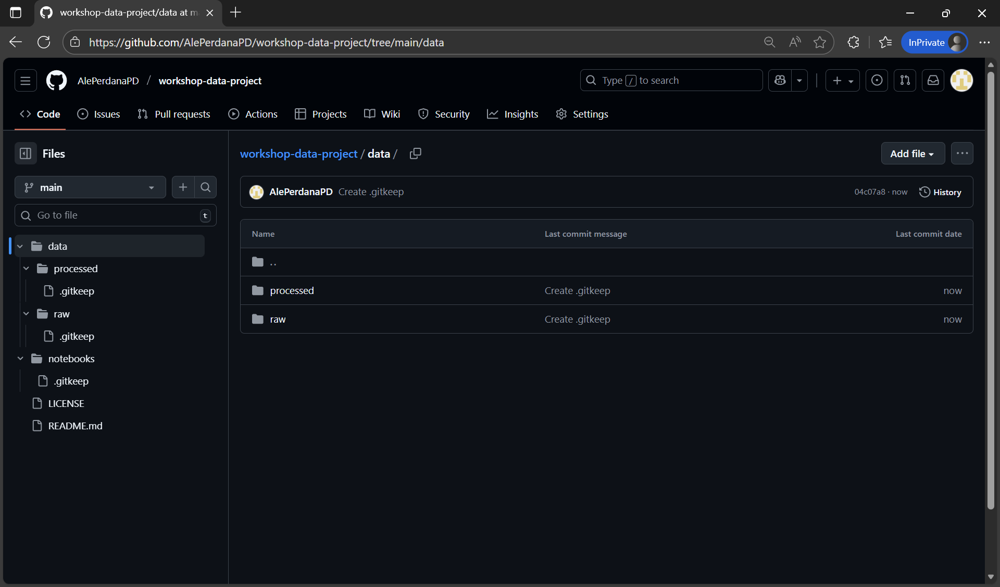

# Struktur Proyek Data yang Kolaboratif

## Tujuan Sesi
- Memahami pentingnya struktur proyek yang konsisten dalam kolaborasi data
- Membangun fondasi direktori yang jelas dan terdokumentasi
- Menyiapkan template awal repository GitHub yang siap digunakan bersama tim

---

## Mengapa Struktur Proyek Penting?

Dalam dunia data, proyek sering melibatkan:
- Banyak file (data mentah, script, notebook, output)
- Banyak orang (analyst, engineer, scientist, stakeholder)
- Banyak iterasi (eksperimen, revisi, deployment)

Tanpa struktur yang jelas, proyek bisa menjadi:
- Sulit dipahami oleh anggota baru
- Rentan terhadap duplikasi atau kehilangan file
- Tidak reproducible atau tidak terdokumentasi dengan baik

> ✨ Prinsip utama: **"Siapa pun harus bisa masuk ke repositori ini dan paham dalam 5 menit."**

---

## Template Struktur Proyek Data

Berikut adalah struktur standar yang direkomendasikan untuk proyek data kolaboratif:

```
nama-proyek/
│
├── data/                     # Semua data (jangan commit data sensitif!)
│   ├── raw/                  # Data asli, tidak boleh diubah
│   ├── processed/            # Data hasil transformasi/cleaning
│
├── notebooks/                # Jupyter/Kaggle notebook untuk eksplorasi
│   ├── 01-iris-eda.ipynb
 
├── README.md                 # Gambaran umum proyek (wajib!)
│
└── requirements.txt          # Daftar dependensi Python (jika ada)
```

> 📌 **Catatan**:  
> - Jangan menyimpan data sensitif, password, atau file berukuran sangat besar di Git.  
> - Untuk dataset besar, cukup simpan **link** ke Kaggle Dataset atau sumber eksternal.

---

## Praktik: Membuat Struktur Proyek Pertama

### Langkah 1: Buat Repository Baru di GitHub
1. Masuk ke [github.com](https://github.com)
2. Klik **New repository**


3. Isi:
   - Nama: `workshop-data-project`
   - Deskripsi: "Proyek latihan workshop kolaborasi data"
   - Centang **Add a README file**
   - Pilih lisensi (misal: MIT License)
4. Klik **Create repository**


5. Repository sudah berhasil dibuat!


---

### Langkah 2: Tambahkan Struktur Dasar
Gunakan GitHub UI untuk membuat folder dan file:

1. Klik tombol **Add file → Create new file**


2. Buat folder `data/raw/` dengan file `.gitkeep`
   - Di bagian `Name your file...`, ketik: `data/raw/.gitkeep`
   - Ini akan otomatis membuat folder `data` dan subfolder `raw` dengan file `.gitkeep`
   Lalu klik tombol **Commit Changes...** untuk membuat folder dan file tersebut.


3. Ulangi untuk:
   - `data/processed/.gitkeep`
   - `notebooks/.gitkeep`


4. Buat file:
   - `requirements.txt` (kosong dulu)


> 🔍 `.gitkeep` adalah trik agar folder kosong tetap terkirim ke Git (karena Git tidak melacak folder kosong).

---

### Langkah 3: Edit `README.md`

1. Klik file **README.md** untuk membukanya


2. Klik tombol **pencil (edit)** untuk mulai mengedit


3. Gantikan isi `README.md` dengan:

```markdown
# Workshop Data Project

Proyek contoh untuk latihan kolaborasi data dengan GitHub & Kaggle.

## Struktur
- `data/`: Data mentah dan hasil olahan
- `notebooks/`: Eksplorasi dan analisis awal
```

4. Klik **Commit changes...** untuk menyimpan perubahan


---

## Best Practices Struktur Proyek
✅ Gunakan nama file yang deskriptif (`01-iris-eda.ipynb`, bukan `iris_eda_v1.ipynb`)  
✅ Tulis README sejak awal — jangan ditunda!  
✅ Pisahkan **data mentah** dan **data hasil olahan**  
✅ Gunakan versi notebook yang ringkas dan fokus

---

## Best Practices Git Workflow: Branching & Commit

### 1. Git Branching

- Gunakan branch utama sebagai produksi:
   - `main` (atau `master`) untuk kode stabil.
- Buat branch fitur dari `main`:
   - Contoh: `feature/setup-kaggle-notebook`, `feature/add-eda-iris`.
- Untuk perbaikan bug gunakan prefix `fix/`:
   - Contoh: `fix/readme-typo`, `fix/eda-plot-error`.
- Untuk eksperimen gunakan prefix `experiment/` (opsional):
   - Contoh: `experiment/new-model-test`.
- Hindari commit langsung ke `main`, selalu lewat:
   - Branch → Pull Request (PR) → Review → Merge.

Contoh alur sederhana:

1. Buat branch baru dari `main`, misalnya `feature/add-eda-iris`.
2. Kerjakan perubahan struktur / notebook di branch tersebut.
3. Push branch ke GitHub dan buat Pull Request.
4. Setelah direview, merge ke `main`.

### 2. Conventional Commit

Format pesan commit:

```text
<type>(optional-scope): <short description>
```

**Type** yang umum dipakai:

- `feat`: menambah fitur baru.
   - Contoh: `feat(notebooks): add iris eda notebook`
- `fix`: memperbaiki bug.
   - Contoh: `fix(readme): correct kaggle link`
- `docs`: perubahan dokumentasi saja.
   - Contoh: `docs: update project structure section`
- `chore`: pekerjaan rutin (config, tooling, dll.).
   - Contoh: `chore: update requirements.txt`
- `refactor`: merapikan kode tanpa mengubah perilaku.
   - Contoh: `refactor: split eda into functions`

**Tips praktik baik:**

- Deskripsi singkat (≤ 72 karakter) dan jelas.
- Satu commit untuk satu perubahan yang logis.
- Tulis dalam bahasa yang konsisten (Indonesia/Inggris, jangan campur).
- Pastikan pesan commit menjawab: *“Apa yang berubah?”* dan *“Mengapa?”* (jika perlu di body).
