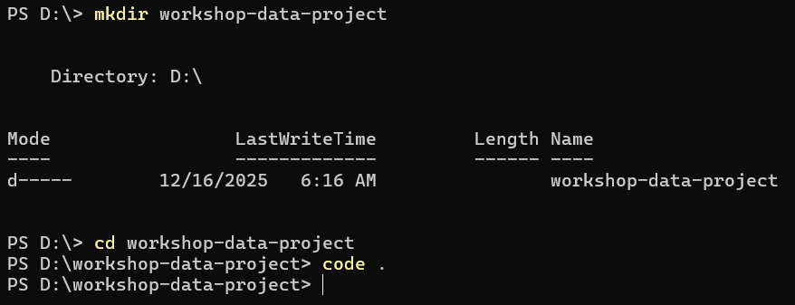
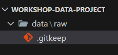
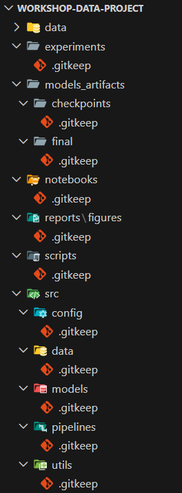

# Struktur Proyek Data

## Tujuan Sesi

* Memahami pentingnya struktur proyek yang konsisten dalam kolaborasi data
* Mengetahui prinsip dasar penyusunan direktori proyek data
* Mengenal template struktur proyek data yang umum dipakai di industri

---

## Mengapa Struktur Proyek Penting?

Dalam dunia data, proyek sering melibatkan:

* Banyak file (data mentah, script, notebook, output)
* Banyak orang (analyst, engineer, scientist, stakeholder)
* Banyak iterasi (eksperimen, revisi, deployment)

Tanpa struktur yang jelas, proyek bisa menjadi:

* Sulit dipahami oleh anggota baru
* Rentan terhadap duplikasi atau kehilangan file
* Tidak reproducible atau tidak terdokumentasi dengan baik

> ✨ Prinsip utama:
> **"Siapa pun harus bisa masuk ke repositori ini dan paham dalam 5 menit."**

---

## Prinsip Dasar Struktur Proyek Data

Beberapa prinsip yang harus dipegang:

* **Pisahkan data mentah dan data olahan**
* **Notebook hanya untuk eksplorasi**, bukan pipeline utama
* **Kode produksi ada di folder `src/`**
* **Eksperimen terdokumentasi**, tidak tersebar
* **Output dan model tidak bercampur dengan source code**

---

## Template Struktur Proyek Data (Lengkap)

Berikut adalah struktur standar yang direkomendasikan untuk proyek data kolaboratif:

```
nama-proyek/
│
├── README.md
├── LICENSE
├── .gitignore
├── .env.example
├── requirements.txt
│
├── data/
│   ├── raw/
│   └── processed/
│
├── notebooks/
│
├── src/
│   ├── config/
│   ├── data/
│   ├── models/
│   ├── pipelines/
│   └── utils/
│
├── experiments/
│
├── models_artifacts/
│   ├── checkpoints/
│   └── final/
│
├── reports/
│   └── figures/
│
└── scripts/
```

---

## Penjelasan Singkat Tiap Folder

* `data/raw/`
  Data mentah dari sumber eksternal (tidak diubah)

* `data/processed/`
  Data hasil cleaning, feature engineering, atau transformasi

* `notebooks/`
  Notebook eksplorasi (EDA, eksperimen awal)

* `src/`
  Source code utama proyek

  * `config/` → konfigurasi
  * `data/` → loading & preprocessing
  * `models/` → training, evaluasi, prediksi
  * `pipelines/` → pipeline end-to-end
  * `utils/` → helper functions

* `experiments/`
  Catatan dan konfigurasi tiap eksperimen

* `models_artifacts/`
  Model hasil training (checkpoint & final)

* `reports/`
  Hasil analisis dan ringkasan

* `scripts/`
  Script CLI untuk training / evaluasi

---

## Praktik Membuat Struktur Proyek Pertama

1. Buka terminal, buat folder proyek dan buka di vscode



2. Buat folder `data/raw/` dengan file `.gitkeep`



3. Ulangi pola yang sama untuk membuat folder penting lainnya:
   - `data/processed/.gitkeep`
   - `notebooks/.gitkeep`
   - `src/config/.gitkeep`
   - `src/data/.gitkeep`
   - `src/models/.gitkeep`
   - `src/pipelines/.gitkeep`
   - `src/utils/.gitkeep`
   - `experiments/.gitkeep`
   - `models_artifacts/checkpoints/.gitkeep`
   - `models_artifacts/final/.gitkeep`
   - `reports/figures/.gitkeep`
   - `scripts/.gitkeep`



---

## Catatan Penting

* ❌ Jangan menyimpan data sensitif atau credential di Git
* ❌ Jangan push dataset besar ke repository
* ✅ Simpan **link dataset** (Kaggle, Drive, S3, dll.)
* ✅ Mulai dari struktur sederhana, lalu berkembang