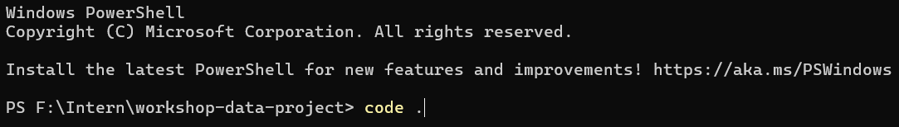
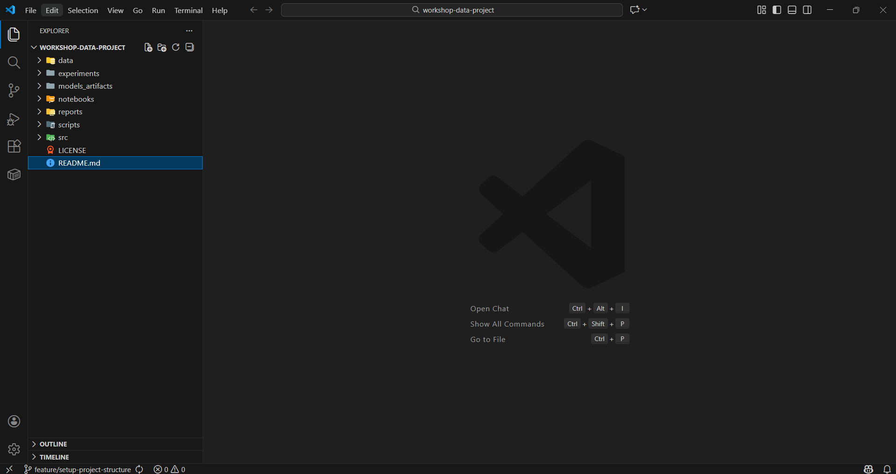
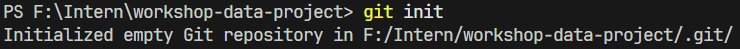
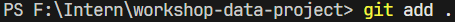
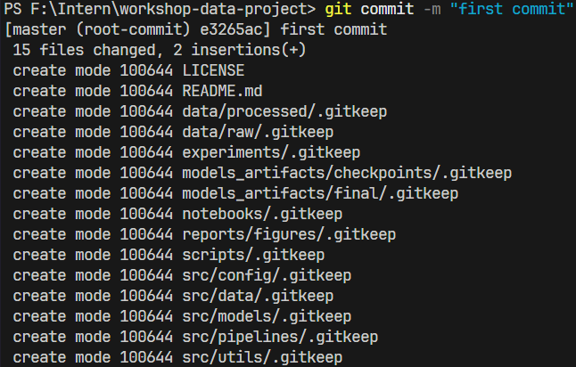
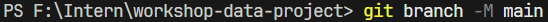
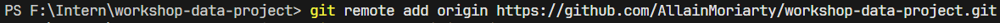
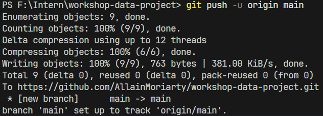
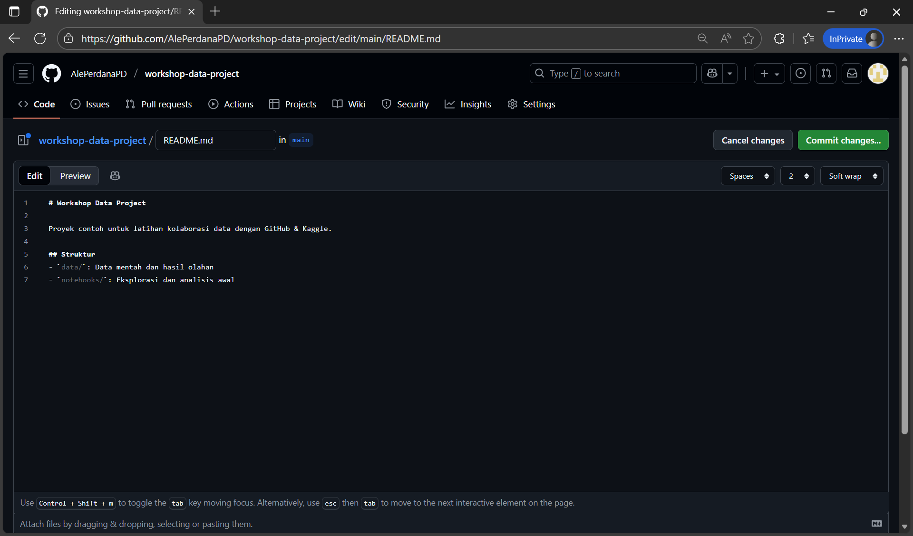

# Integrasi Proyek ke VS Code & GitHub

## Tujuan Sesi

* Mengintegrasikan struktur proyek ke VS Code
* Menginisialisasi Git repository
* Menghubungkan proyek lokal dengan GitHub
* Melakukan commit dan push pertama

---

## Langkah 1: Membuka Proyek di VS Code

1. Buka proyek data yang telah kita buat sebelumnya



2. Buka folder tersebut menggunakan **VS Code**



3. Pastikan struktur folder sudah sesuai Materi 1!

---

## Langkah 2: Inisialisasi Git Repository

Di folder proyek:

```bash
git init
```



---

## Langkah 3: Commit Pertama (Struktur Proyek)

1. Stage semua file



2. Lanjutkan dengan commit



---

## Langkah 4: Buat Repository di GitHub

1. Masuk ke GitHub → **New repository**


2. Create repository


3. Repository sudah berhasil dibuat!


---

## Langkah 5: Hubungkan Lokal ke GitHub

1. Pastikan branch utama bernama main

```bash
git branch -M main
```



2. Tambahkan remote repository GitHub

```bash
git remote add origin <url-repository>
```



3. Push kode lokal ke GitHub
```bash
git push -u origin main
```



---

## Langkah 6: Menulis README.md

1. Klik file **README.md** untuk membukanya


2. Klik tombol **pencil (edit)** untuk mulai mengedit


3. Gantikan isi `README.md` dengan:

```markdown
# Workshop Data Project

Proyek contoh untuk latihan kolaborasi data dengan GitHub & Kaggle.

## Struktur Proyek
- `data/raw/`         : data mentah dari sumber eksternal (mis. dataset_1)
- `data/processed/`   : data siap pakai untuk training / evaluasi
- `notebooks/`        : eksplorasi data & eksperimen awal
- `src/config/`       : konfigurasi proyek (config, logging)
- `src/data/`         : script loading, split, dan persiapan dataset
- `src/models/`       : script training, evaluasi, dan prediksi model
- `src/pipelines/`    : pipeline end-to-end untuk training
- `src/utils/`        : fungsi pendukung (seed, metrics, dll.)
- `experiments/`      : konfigurasi & catatan tiap eksperimen
- `models_artifacts/` : checkpoint dan model final
- `reports/`          : hasil analisis, gambar, dan ringkasan
- `scripts/`          : script command-line (train, evaluate, dll.)
```

4. Klik **Commit changes...** untuk menyimpan perubahan



---
