# Git Branching & Conventional Commit 

## Tujuan Sesi

* Memahami kenapa branching penting dalam kolaborasi proyek data
* Memahami format dasar Conventional Commit
* Mampu menerapkan workflow sederhana: clone → buat branch → commit → pull request → merge

---

## 1. Konsep Dasar Git Branching

Git Branching membantu anda:

* Mencoba fitur baru tanpa merusak `main`
* Memisahkan pekerjaan antar anggota tim
* Menjaga `main` selalu dalam kondisi stabil/siap rilis

### Conventional Branching

Beberapa pola nama branch yang umum:

* **Branch utama (stabil)**

  * `main` → kode yang sudah teruji dan siap dipakai
* **Branch fitur (feature branch)**

  * Prefix: `feature/`
  * Contoh: `feature/setup-kaggle-notebook`, `feature/add-eda-iris`
* **Branch perbaikan bug (bugfix branch)**

  * Prefix: `fix/`
  * Contoh: `fix/readme-typo`, `fix/eda-plot-error`
* **Branch eksperimen (opsional)**

  * Prefix: `experiment/`
  * Contoh: `experiment/new-model-test`

> 🎯 Prinsip: **jangan kerja langsung di `main`** untuk perubahan besar. Selalu lewat branch terpisah.

---

## 2. Praktik: Workflow Branching Sederhana

Bayangkan anda ingin menambah struktur proyek dan README seperti di modul `1.2`.

### Langkah 0: Clone Repository ke Lokal

1. Buka repositori GitHub yang ingin anda kerjakan.
2. Klik tombol **Code** → copy URL repository (HTTPS atau SSH).

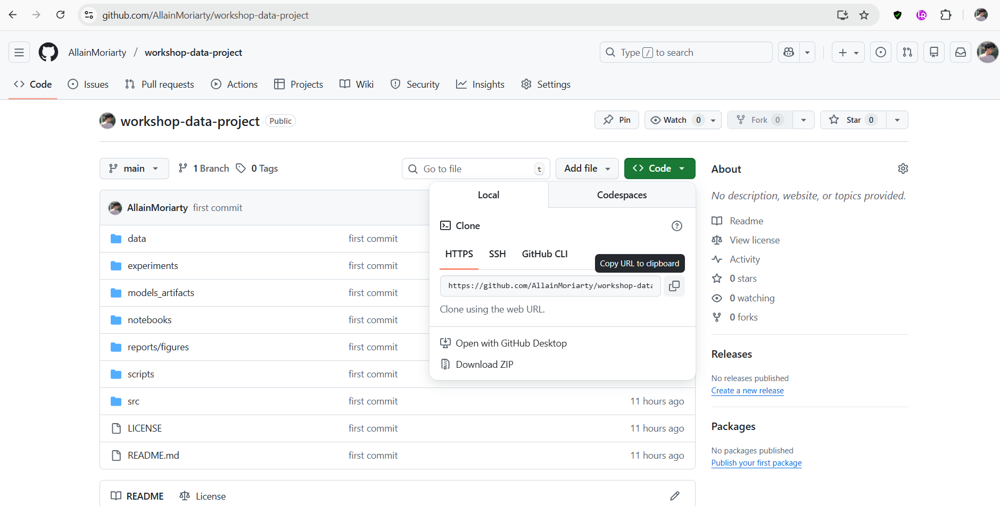

3. Di terminal, jalankan:

```bash
git clone https://github.com/username/nama-repo.git
```

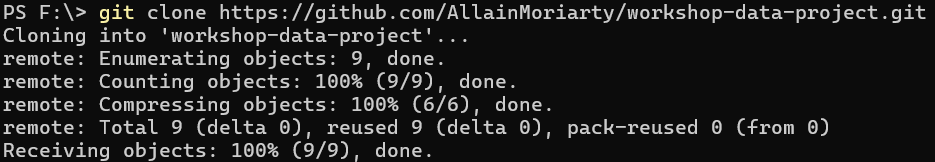

4. Masuk ke folder project:

```bash
cd nama-repo
```

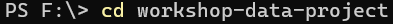

5. Pastikan anda berada di branch `main`:

```bash
git branch
```

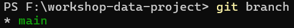

> Jika branch aktif bertanda `* main`, berarti sudah siap lanjut.

---

### Langkah 1: Buat Branch Baru

1. Pastikan branch utama up-to-date (opsional tapi disarankan):

```bash
git pull origin main
```

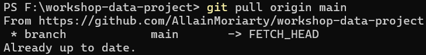

2. Buat branch baru dari `main`:

```bash
git checkout -b feature/setup-project-structure
```

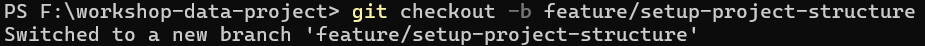

3. Sekarang semua perubahanmu akan tercatat di branch `feature/setup-project-structure`.

---

### Langkah 2: Lakukan Perubahan dan Commit

1. Edit struktur folder, notebook, atau README sesuai kebutuhan.

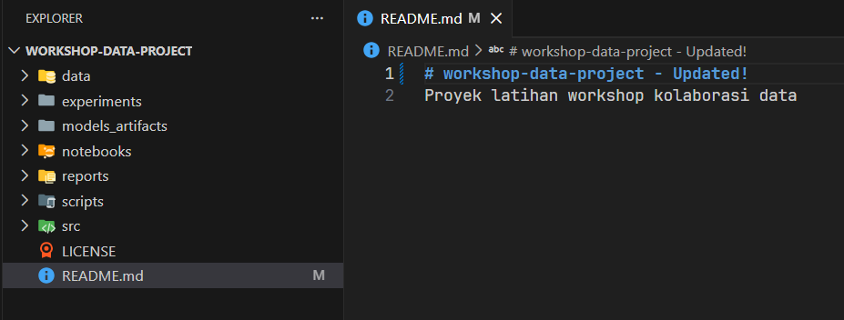

2. Cek status perubahan:

```bash
git status
```

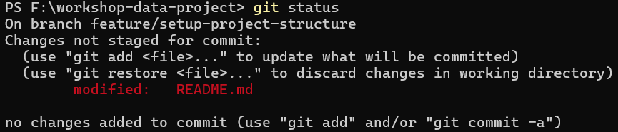

3. Tambahkan file yang ingin anda commit:

```bash
git add .
```


4. Buat commit dengan pesan yang rapi (mengikuti Conventional Commit – dibahas di bawah):

```bash
git commit -m "feat(structure): modify README.md"
```

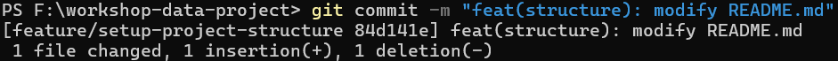

---

### Langkah 3: Push & Buka Pull Request

1. Push branch ke GitHub:

```bash
git push -u origin feature/setup-project-structure
```

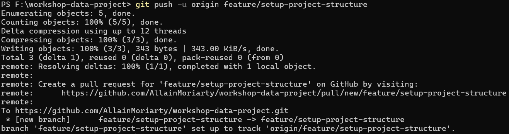

2. Di GitHub, buka repositorimu → akan muncul tombol **Compare & pull request**.

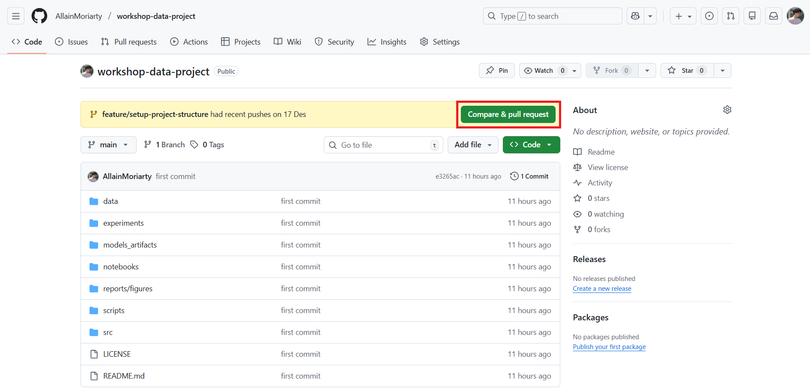

3. Buat Pull Request, beri judul dan deskripsi singkat.

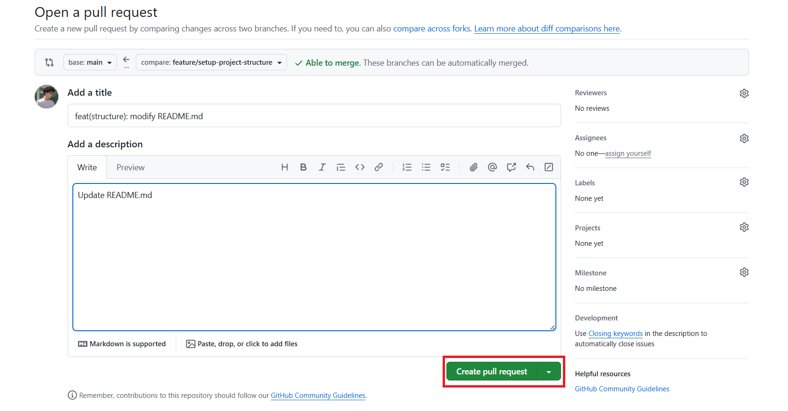

4. Setelah direview, merge ke `main`.

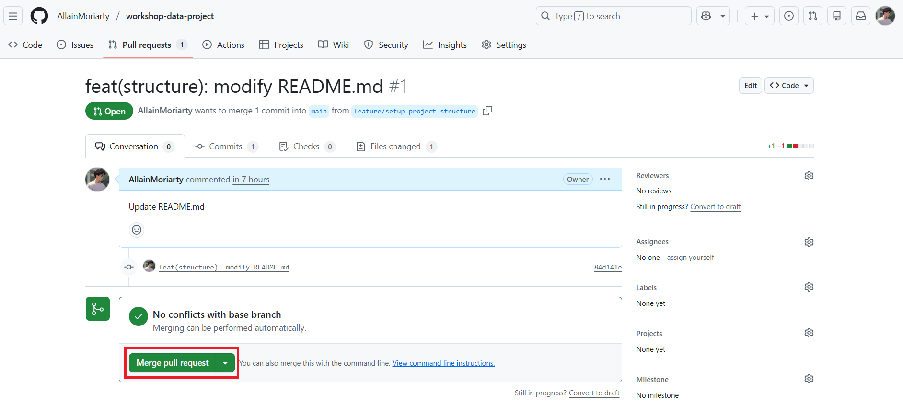


---

## 3. Conventional Commit

Conventional Commit adalah **aturan penulisan pesan commit** agar konsisten dan mudah dibaca.

### Format Dasar

```text
<type>(optional-scope): <short description>
```

Contoh:

```text
feat(notebooks): add iris eda notebook
fix(readme): correct kaggle link
```

---

### Type yang Umum Dipakai

* `feat`    : menambah fitur baru

  * `feat(structure): add src and reports folders`
* `fix`     : memperbaiki bug

  * `fix(notebooks): handle empty dataset`
* `docs`    : perubahan dokumentasi saja

  * `docs: update project structure section`
* `chore`   : pekerjaan rutin (config, tooling, dll.)

  * `chore: update requirements.txt`
* `refactor`: merapikan kode tanpa mengubah perilaku

  * `refactor: split eda into functions`

> 💡 Anda bisa menambah type lain (`test`, `style`, dll.) sesuai kebutuhan tim, yang penting konsisten.

---

### Tips Praktik Baik

* Gunakan deskripsi singkat (≤ 72 karakter) dan jelas
* Satu commit untuk satu perubahan yang logis
* Gunakan bahasa yang konsisten (Indonesia / Inggris)
* Pesan commit harus menjawab:
  **“Apa yang berubah?”** dan **“Mengapa?”** (jika perlu)