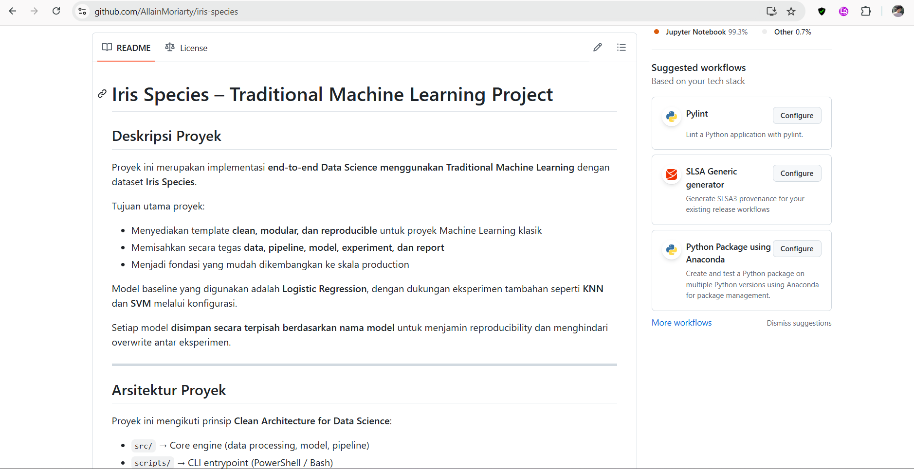

# Publikasi & Integrasi GitHub–Kaggle

## Tujuan Sesi
- Memahami alur **publikasi notebook** di Kaggle  
- Menyambungkan hasil analisis di Kaggle dengan **dokumentasi di GitHub**  
- Menghasilkan **proyek data terdokumentasi dan dapat diakses publik**  
- Menyiapkan template kolaboratif yang siap digunakan kembali

---

## Mengapa Integrasi GitHub–Kaggle Penting?

> **Kaggle** = tempat menganalisis dan bereksperimen  
> **GitHub** = tempat menyimpan, mendokumentasi, dan berkolaborasi  

Tanpa integrasi:
- Analisis hanya ada di Kaggle → sulit dilacak oleh tim di GitHub  
- Dokumentasi di GitHub tidak mencerminkan hasil nyata

Dengan integrasi:
- Siapa pun bisa **membaca insight** di GitHub  
- Sekaligus **melihat kode & visualisasi** langsung di Kaggle  
- Proyek jadi **reproducible, transparan, dan profesional**

> 🎯 Prinsip kolaborasi modern:  
> **“Satu proyek, dua platform — masing-masing memainkan perannya.”**

---

## Langkah 1: Publikasikan Notebook di Kaggle

### A. Simpan Versi Terakhir
1. Pastikan semua cell sudah dijalankan (lihat tanda ▶️ biru)
2. Klik **Save Version** → pilih **Save & Run All (Commit)**


3. Tunggu proses selesai (±2–5 menit)


### B. Ubah ke Status Publik
1. Setelah selesai, Buka notebook Anda di Kaggle
2. Klik tombol **Share** di kanan atas


3. Pilih **“Public”**
4. Salin **URL notebook publik** (misal: `https://www.kaggle.com/username/nama-notebook`)
5. Kemudian save

> ✅ Pastikan:
> - Judul jelas (misal: `EDA Iris – Workshop Kolaborasi Data`)
> - Deskripsi singkat di bagian atas notebook
> - Semua visualisasi muncul dengan baik

---

## Langkah 2: Perbarui Dokumentasi di GitHub

Sekarang, kita sambungkan Kaggle ke GitHub.

### A. Edit `README.md` di Repositori
Tambahkan bagian baru:

```markdown
# Iris Species – Traditional Machine Learning Project

Link Kaggle Notebook: https://www.kaggle.com/code/allainkaggle/eda-iris-workshop-kolaborasi-data

## Deskripsi Proyek

Proyek ini merupakan implementasi **end-to-end Data Science menggunakan Traditional Machine Learning** dengan dataset **Iris Species**.

Tujuan utama proyek:

* Menyediakan template **clean, modular, dan reproducible** untuk proyek Machine Learning klasik
* Memisahkan secara tegas **data, pipeline, model, experiment, dan report**
* Menjadi fondasi yang mudah dikembangkan ke skala production

Model baseline yang digunakan adalah **Logistic Regression**, dengan dukungan eksperimen tambahan seperti **KNN** dan **SVM** melalui konfigurasi.

Setiap model **disimpan secara terpisah berdasarkan nama model** untuk menjamin reproducibility dan menghindari overwrite antar eksperimen.

---

## Arsitektur Proyek

Proyek ini mengikuti prinsip **Clean Architecture for Data Science**:

* `src/` → Core engine (data processing, model, pipeline)
* `scripts/` → CLI entrypoint (PowerShell / Bash)
* `experiments/` → Konfigurasi dan catatan eksperimen
* `models_artifacts/` → Model hasil training dan checkpoint
* `reports/` → Hasil evaluasi model
* `data/` → Dataset (raw dan processed)

Setiap layer bersifat independen dan **tidak saling melanggar dependency**.

---

## Struktur Folder

project/
├── data/
│   ├── raw/
│   │   └── iris.csv
│   └── processed/
│
├── src/
│   ├── config/
│   ├── data/
│   ├── models/
│   ├── pipelines/
│   └── utils/
│
├── experiments/
├── models_artifacts/
│   └── final/
│       ├── logistic_regression.joblib
│       ├── knn.joblib
│       └── svm.joblib
├── reports/
├── scripts/
├── LICENSE
├── requirements.txt
└── README.md

---

## Dataset

* Nama: Iris Species Dataset
* Format: CSV
* Lokasi: `data/raw/iris.csv`
* Target column: `species`
* Features:

  * sepal_length
  * sepal_width
  * petal_length
  * petal_width

Dataset **bersifat read-only** dan **tidak boleh dimodifikasi**. Semua proses dilakukan pada data hasil split di folder `processed/`.

---

## Setup Environment

### 1. Virtual Environment (opsional)
```powershell
python -m venv .venv
.\.venv\Scripts\activate

### 2. Install Dependency
```powershell
pip install -r requirements.txt

Library utama yang digunakan:

* pandas
* numpy
* scikit-learn
* joblib
* pyyaml

---

## Menjalankan Pipeline

### Training dan Evaluation

.\scripts\train.ps1

Pipeline ini akan menjalankan tahapan berikut:

1. Load dataset dari `data/raw/iris.csv`
2. Split data train / validation / test secara stratified
3. Simpan hasil split ke `data/processed/`
4. Training model sesuai konfigurasi eksperimen
5. Simpan model ke `models_artifacts/final/<model_name>.joblib`
6. Simpan metrik evaluasi ke `reports/results.md`

### Menjalankan Eksperimen Model

Logistic Regression:

```powershell
.\scripts\train.ps1 experiments\exp_001_logreg\config.yaml

KNN:

```powershell
.\scripts\train.ps1 experiments\exp_002_knn\config.yaml

SVM:

```powershell
.\scripts\train.ps1 experiments\exp_003_svm\config.yaml

---

### Evaluasi Saja
Logistic Regression:

```powershell
.\scripts\evaluate.ps1 experiments\exp_001_logreg\config.yaml

KNN:

```powershell
.\scripts\evaluate.ps1 experiments\exp_002_knn\config.yaml

SVM:

```powershell
.\scripts\evaluate.ps1 experiments\exp_003_svm\config.yaml

Evaluasi **selalu menggunakan model sesuai experiment config**.
```


---

## Langkah 3: Review Struktur Proyek Akhir

Pastikan repositori memiliki:

```
project/
├── data/
│   ├── raw/
│   │   └── iris.csv
│   └── processed/
│
├── src/
│   ├── config/
│   ├── data/
│   ├── models/
│   ├── pipelines/
│   └── utils/
│
├── experiments/
│   ├── exp_001_logreg/
│   ├── exp_002_knn/
│   └── exp_003_svm/
│
├── models_artifacts/
│   ├── checkpoints/
│   └── final/
│       ├── logistic_regression.joblib
│       ├── knn.joblib
│       └── svm.joblib
├── reports/
├── scripts/
├── LICENSE
├── requirements.txt
└── README.md
```

---

## Best Practices Integrasi

✅ **Jangan duplikasi kode**:  
   - Jangan salin seluruh notebook ke GitHub  
   - Cukup tautkan ke Kaggle

✅ **Gunakan README sebagai “pintu masuk”**:  
   - Jelaskan konteks, dataset, insight, dan link utama

✅ **Jaga konsistensi nama**:  
   - Nama notebook di Kaggle ≈ nama proyek di GitHub

✅ **Publikasikan hanya versi final**:  
   - Hindari mempublikasikan draft atau versi error

> 💡 Ingat:  
> **Publikasi = kontribusi ke komunitas!**  
> Orang lain bisa belajar dari analisis Anda.

---